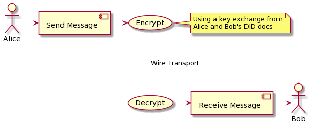

# DIDComm Extension for gRPC

Implementation and message definition for extending DIDComm Messaging v2 using binary protocol (protobuf) and HTTP/2 transport (gRPC).

## Table of Contents

- [Motivation](#motivation)
  - [Design Approach](#design-approach)
- [Extension Architecture](#extension-architecture)
  - [Native Security Library](#native-security-library)
  - [Other Protocols](#other-protocols)
- [Interface Definition](#interface-definition)
  - [Message Structure](#message-structure)
  - [Message Encryption](#message-encryption)
  - [Message Signing](#message-signing)
  - [Endpoints and Transport](#endpoints-and-transport)
- [Supported Platforms](#supported-platforms)
  - [Rust](native/README.md)
  - [.NET](dotnet/README.md)
  - [WebAssembly](wasm/README.md)
  - [Swift/Objective C](swift/README.md)
  - Planned
    - Kotlin/Java
    - Python
    - Go
    - Dart
- [License](LICENSE)
- [Get Involved](#get-involved) 🙌

---

## Motivation

[DIDComm Messaging](https://identity.foundation/didcomm-messaging/spec/#purpose-and-scope) provides a secure, private communication methodology built atop the decentralized design of DIDs. The spec defines a concrete message definition using JSON notation, and allows for other protocols to be defined.
This extension of the DIDComm Messaging protocol introduces [Protocol Buffers](https://developers.google.com/protocol-buffers) (Protobuf) as a language defintion for the message contracts.
Protobuf is language-neutral, platform-neutral, extensible mechanism for serializing structured data. In addition, it offers a concrete RPC protocol stack for remote services called gRPC.<br />
Protobuf and gRPC focus on interface definition and code generation to achieve multiplatform, zero-code application architecture. DIDComm Messaging can leverage this to provide availability and interoperability between different platforms.

### Design Approach

In order to extend DIDComm Messaging for use with other protocols, we need to provide a solution in the following areas:

- Message contract
- Security layer
- Transport



*<small><center>Figure 1: Components of DIDComm exchange</center></small>*

For the **message contracts** in this extension we will use protocol buffers message descriptors. See the section on [Message Structure](#message-structure) for different message formats.<br />
**Security layer** is done using a Rust library that can perform security related operations, such as message packing, signing, etc.<br />
The **transport of messages** relies entirely on gRPC components. The DIDComm endpoints are described as RPC services along the message definitions.

## Extension Architecture

An important factor in driving DIDComm Messaging adoption is providing libraries for multiple languages. gRPC and Protobuf libraries are already highly available; this extensions provides the missing component in the secutiry layer and packs everything together.

### Native Security Library

This library is built in Rust and avaialble for all architectures. It supports the encryption and signing algorithms [defined](https://identity.foundation/didcomm-messaging/spec/#message-encryption) in the DIDComm Messaging spec. Additionally, it provides basic utility methods for working with `did:key` method, using `ed25519`, `x25519` and `p256` key types.
This libary exposes all functionality through a simple foreign function interface (FFI). All functions exposed have the same method signature:

```rust
pub extern "C" fn didcomm_pack(request: ByteBuffer, response: &mut ByteBuffer, err: &mut ExternError) -> i32

pub extern "C" fn didcomm_sign(request: ByteBuffer, response: &mut ByteBuffer, err: &mut ExternError) -> i32
```

This allows us to use the protobuf encoded payloads as request and response to each interface. By convention, the request and response message types are named after the function. For example, the function `didcomm_generate_key` uses `GenerateKeyRequest` for input and `GenerateKeyResponse` for output message. The corresponding protobuf messages are defined as:

```protobuf
message GenerateKeyRequest {
    bytes seed = 1;
    KeyType key_type = 2;
}
message GenerateKeyResponse {
    Key key = 1;
}
```

All FFI messages are maintained in the [api.proto](proto/api.proto) file.

This approach makes it easy to create and maintain platform specific wrappers. Due to the code generation capabilities of gRPC libraries, these API contracts are instantly available to us, so we can immedately start using them:

```js
    // JavaScript

    let request = new dm.GenerateKeyRequest({
      keyType: dm.KeyType.x25519,
    });

    var response = generateKey(request);
```

```swift
    // Swift

    var request = Didcomm_Messaging_GenerateKeyRequest()
    request.keyType = .ed25519

    let response = try DIDCommGrpc.generateKey(request: request)
```

```cs
    // C#

    var request = new GenerateKeyRequest { KeyType = KeyType.Ed25519 };

    var response = DIDComm.GenerateKey(request);

```

### Other Protocols

This architecture is general enough that it can easily accomodate other protocols. For example, [Thrift](https://thrift.apache.org) and [Avro](https://avro.apache.org/docs/1.3.0/) take very similar approach to interface definitions and RPC service support; it would be fairly trivial to write plugin or separate extension to support them. While CBOR is schemaless serialization format, it can also be used in conjuction with any data modeling solution like [YANG](https://tools.ietf.org/html/draft-ietf-core-yang-cbor-13), though this is not required.

## Data Contract Definition

All data contracts used in DIDComm Messaging over gRPC are defined in three groups

- Security Messages ([security.proto](proto/security.proto)) - defines the messages used in the transport and security layer, such as `EncryptedMessage`, `SignedMessage` in addition to messages supporting key formats
- API/FFI messages ([api.proto](proto/api.proto)) - defines the messages used by the native library FFI layer. These messages are not part of the DIDComm spec and are used as a common format for interacting with the security APIs.
- DIDComm Messages and Services ([didcomm.proto](proto/didcomm.proto)) - defines the common DIDComm message and a proposed set of RPC services used for DIDComm transport

### Message Structure

The DIDComm spec defines the message structure using JWM message types. JWM message allows any set of attributes to be encoded in its `body` attribute.

```json
{
    "id": "1234567890",
    "type": "<message-type-uri>",
    "from": "did:example:alice",
    "to": ["did:example:bob"],
    "created_time": 1516269022,
    "expires_time": 1516385931,
    "body": {
    	"messagespecificattribute": "and it's value"
	}
}
```
JWM can be expressed in proto syntax as:

```protobuf
message CoreMessage {
    string id = 1;
    string type = 2;
    bytes body = 3;
    repeated string to = 4;
    string from = 5;
    int64 created = 7     [json_name="created_time"]; // custom name mapping
    int64 expires = 8     [json_name="expires_time"];
}
```

Similar to the JSON format, custom messages will be encoded in the `body` field as byte strings. For example, consider the following custom message
```protobuf
message CustomMessage {
    string messagespecificattribute = 1;
}
```

This message can be embedded in the JWM proto message like this:

```cs
var message = new CoreMessage
{
  Id = "1234567890",
  Type = "https://didcomm.org/custom/1.0/custom_message",
  Body = new CustomMessage { Messagespecificattribute = "and it's value" }.ToByteString()
}
```

> JSON is a first class citizen in protobuf syntax that allows attributes to be mapped directly to their JSON field. Most protobuf libraries support easy conversion between JSON and Protobuf. This can give some flexibility when supporting multiple DIDComm formats.

In cases where JOSE formats require serialization, usually into base64 or UTF8 bytes format to sign or encrypt payloads, protobuf simply uses the `bytes` type. The default serialization into binary is enough to avoid needing additional encodings.

### Message Encryption

The core DIDComm spec defines JWE as the message format for encrypted payloads. This library supports XChaCha20Poly1305 and AES-GCM with a 256 bit key encryption algorithms.<br />
Similar to JWM, a JWE can be represented in protobuf as a set of message compositions:

```protobuf
message EncryptedMessage {
    bytes iv = 1                                    [json_name="iv"];
    bytes aad = 2                                   [json_name="aad"];
    bytes ciphertext = 3                            [json_name="ciphertext"];
    bytes tag = 4;
    repeated EncryptionRecipient recipients = 5;
}

message EncryptionHeader {
    EncryptionMode mode = 1                         [json_name="enc"];
    EncryptionAlgorithm algorithm = 2               [json_name="alg"];
    string key_id = 3                               [json_name="kid"];
    string sender_key_id = 4                        [json_name="skid"];
}

message EncryptionRecipient {
    EncryptionHeader header = 1                     [json_name="unprotected"];
    bytes content_encryption_key = 2                [json_name="cek"];
}

enum EncryptionMode {
    direct = 0;
    content_encryption_key = 1;
}

enum EncryptionAlgorithm {
    xchacha20poly1305 = 0;
    aes_gcm = 1;
}
```

This syntax isn't an exact match of the JWE syntax, and the intent is not to have direct compatibility. It is a somewhat simplified format that takes into account the requirements of the spec to provide an envelope that can be represented authenticated encryption using keys as DID urls, while following established JWE spec patterns.
> While it is possible to provide formats that would interoperate, i.e. encrypt into JWE using JOSE libraries and decrypt using gRPC extension, this is not the intention of this effort. We believe this kind of approach constraints implementations to always conform to the JOSE format and stunts the ability to innovate beyond standardized JSON structure.

### Message Signing

The DIDComm spec defines message signing using JWS format. This message can be described using proto syntax:

```protobuf
message SignedMessage {
    bytes payload = 1;
    repeated Signature signatures = 2;
}
message Signature {
    bytes header = 1        [json_name="protected"];
    bytes signature = 3;
}
message SignatureHeader {
    string algorithm = 1;
    string key_id = 2;
}
```

Similar to JWS, the signature in this format is produced by concatenating the `SignedMessage.payload` field and the corresponding `Signature.header`. The type of the field `header` is `bytes` which represents encoded `SignatureHeader`. The reason for this is to guarantee the same representation when verifying the signature. JWS uses the field `protected` for this purpose. This format also allows multiple signatures to be attached in the message. <br/>

> It is expected that the signed payload of `SignedMesage` and `EncryptedMessage` will always be a `DCMessage` (or JWM in this example). Messages can also be nested in each other.

### Endpoints and Transport

TODO

## Supported Platforms

- [Rust](native/README.md)
- [.NET](dotnet/README.md)
- [WebAssembly](wasm/README.md)
- [Swift/Objective C](swift/README.md)

## Get Involved
